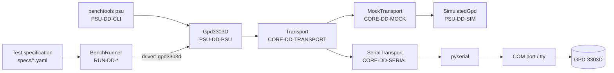
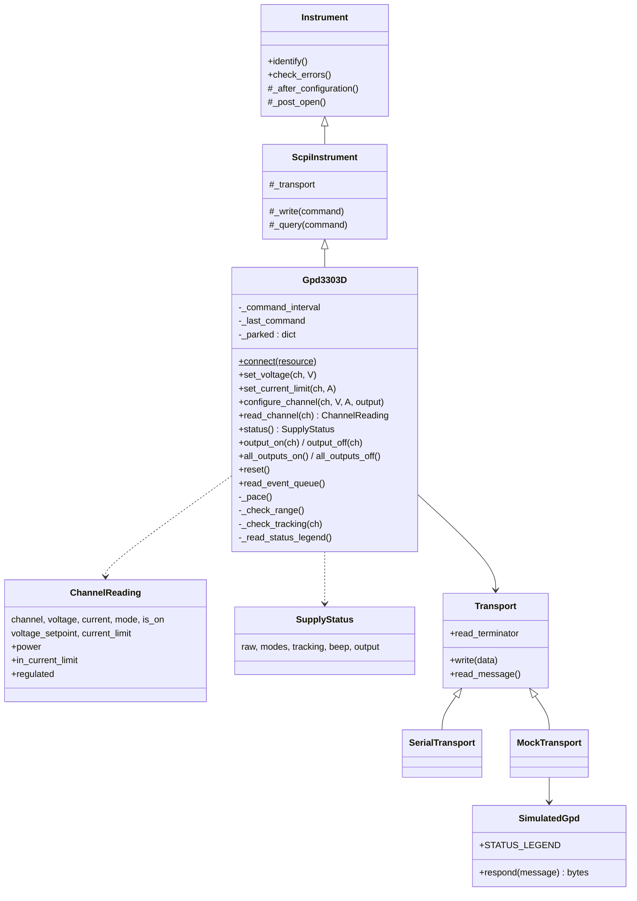
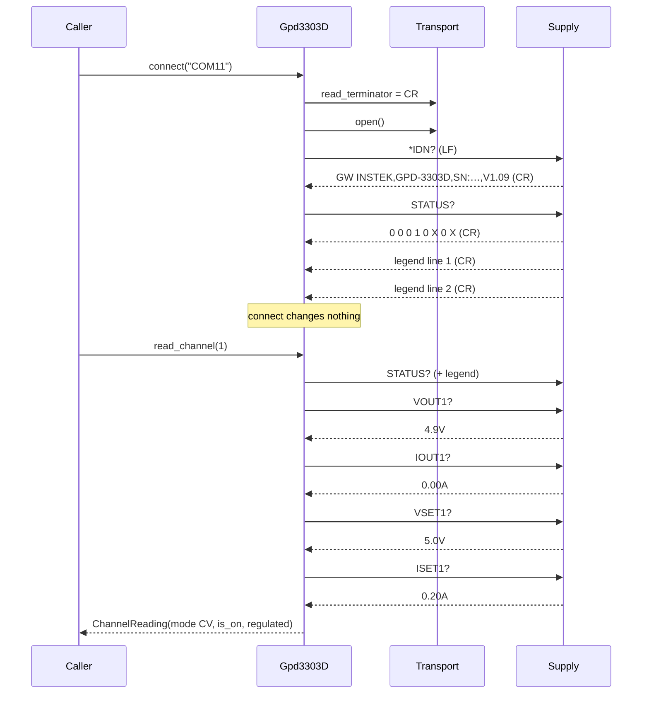

# GPD-3303D Driver Design and Lessons Learned

*Automotive SPICE® PAM v4.0 | SWE.3 Software Detailed Design and Unit Construction (component design) — with a lessons-learned record supporting MAN.3 and SUP.9*

---

## 1. Document Identification & Control

| Field | Value | Field | Value |
|---|---|---|---|
| **Document ID** | ETB-SWE3-002 | **Version** | 0.3 |
| **Project** | Embedded Test Bench | **Date** | 2026-10-05 |
| **Status** | Draft | **Classification** | Internal |
| **Author** | Claude | **Reviewer** | Dermot Murphy |
| **Approver** | Dermot Murphy | **Related Process** | SWE.3; MAN.3, SUP.9 (§9) |

> **Note — Reviewer independence (ETB-DEV-002):** The Reviewer and Approver are the same person (Dermot Murphy). This is accepted under deviation record **ETB-DEV-002** (`docs/aspice/EmbeddedTestBench_DEV002_Independent_Review_Deviation.md`) on the basis that Embedded Test Bench has a single human team member.

---

## 2. Revision History

| Version | Date | Author | Description of Change |
|---|---|---|---|
| 0.1 | 2026-09-26 | Claude | Initial, after bringing the driver up on a real supply (#61, #64, #63). |
| 0.2 | 2026-10-04 | Claude | #183: product renamed to Embedded Test Bench - document file name prefix `EmbeddedTestBench_`, identifier prefix `ETB-` (was `TB-`), product name in prose. Earlier revision rows keep the names in use when they were written. |
| 0.3 | 2026-10-05 | Claude | #194: the compact brand logo added above the title, the same line in every controlled document (ETB-SUP8-001 §6.3). |

---

## 3. Purpose & Scope

### 3.1 Purpose

ETB-SWE3-001 §5.7 declares the four design units of the GPD-3303D element and is
still the document that declares them. This document shows how those units fit
together as one component, why each non-obvious decision was taken, and what
was learned while making the driver work on a real supply.

Most of the lessons in §9 are generic: they apply to any instrument whose
driver and simulator are written before the hardware is on the bench. They are
recorded so that the next driver does not repeat them.

### 3.2 Scope

The package `benchtools.instruments.gpd3303d`, plus the parts of
`benchtools.core.transport` that it depends on and that were changed for it.

### 3.3 Referenced Documents

| Document ID | Title | Version |
|---|---|---|
| ETB-IF-001 | GPD-3303D Remote Control Interface Specification | 0.1 |
| ETB-SWE1-001 | Embedded Test Bench Software Requirements Specification | 0.1 |
| ETB-SWE2-001 | Embedded Test Bench Software Architecture Description | 0.1 |
| ETB-SWE3-001 | Embedded Test Bench Software Detailed Design | 0.4 |
| ETB-SWE4-001 | Embedded Test Bench Software Unit Verification Specification | 0.2 |
| ETB-SUP9-001 | Embedded Test Bench Problem Resolution Management Plan | 0.1 |
| ETB-MAN5-001 | Embedded Test Bench Risk Management Plan (ETB-RISK-004) | 0.1 |

### 3.4 Change History of the Component

| Issue / PR | Change |
|---|---|
| Original | Driver, simulator and CLI written from the programming manual |
| #61 / PR #62 | Made to work with a real supply: reply terminator, `STATUS?` format and bit assignments, read-back resolution, CC-while-off, and the serial-transport timeout fault |
| #64 / PR #65 | An out-of-range setting is rejected by the supply, not clamped. Stated reasons, simulator, PSU-FR-002 and PSU-FR-003 corrected. |
| #63 | This document and ETB-IF-001 |

---

## 4. Context

The driver is reached in two ways. The bench runner uses it under the names
`gpd3303d` and `gwinstek-psu`, registered in `runner/bench.py`. The command
line reaches it through `benchtools psu`. Both build it through
`Gpd3303D.connect(resource)`. The resource string alone selects the real link
(`COM11`, `/dev/ttyUSB0`, `serial://…`, `socket://…`) or the simulator
(`sim://`). Nothing above the transport knows which one it has.

---

## 5. Structure

### 5.1 Modules and design units

| Module | Design unit | Holds |
|---|---|---|
| `constants.py` | PSU-DD-CONST | Ratings; programming and read-back resolution; `REPLY_TERMINATOR`; `STATUS?` layout (`STATUS_LENGTH`, `STATUS_LEGEND_LINES`, `STATUS_BIT_BEEP`, `STATUS_BIT_OUTPUT`, `TRACKING_MODES`); `DEFAULT_COMMAND_INTERVAL`; the CV/CC and tracking vocabularies |
| `psu.py` | PSU-DD-PSU | `Gpd3303D`; the result records `ChannelReading` and `SupplyStatus` |
| `simulator.py` | PSU-DD-SIM | `SimulatedGpd` (the command set) and `SimulatedChannel` (a load model) |
| `cli.py` | PSU-DD-CLI | `benchtools psu` sub-commands, with JSON output |
| `core/transport/base.py` | CORE-DD-TRANSPORT | Buffered framing, including the separate `read_terminator` |
| `core/transport/serial_port.py` | CORE-DD-SERIAL | The pyserial link |

### 5.2 Classes

`Gpd3303D` inherits from `ScpiInstrument` for its transport handling and
lifecycle only. The supply is not a SCPI instrument: it answers `*IDN?` and no
other IEEE 488.2 command (ETB-IF-001 §6.1). Everything else that SCPI would
provide — reset, error queue, status — is replaced explicitly.

### 5.3 Connect and read a channel

Commands are at least `command_interval` apart (50 ms by default on a real
link, zero on a simulated one). The interval is measured from the end of the
previous exchange.

### 5.4 State held by the driver

| State | Where | Lifetime | Why |
|---|---|---|---|
| Parked setpoints | `Gpd3303D._parked` | One driver instance | A channel switched off is programmed to 0 V. Its setpoint is kept so that switching it on again restores it (AD-19). |
| Time of last command | `_last_command` | One instance | Pacing |
| Identity | `Instrument._identity` | One instance | Read once at connect |

Nothing else is cached. The tracking mode in particular is read from the
supply at every write that depends on it, because it is a front-panel switch
that can move between two commands.

**Limitation (observed 2026-09-26).** Parked state does not outlive the
process. `benchtools psu -r COM11 off 1` parks CH1 at 0 V and exits. A later
`read`, in a new process, sees CH1 as on with a setpoint of 0.0 V, and a later
`on 1` cannot restore the old setpoint. Within one Python session, or one
bench run, the emulation behaves as specified. Across CLI invocations it does
not. Recorded as open item D-OPEN-01.

---

## 6. Design Decisions

| # | Decision | Rationale | Trace |
|---|---|---|---|
| D-01 | Reuse `ScpiInstrument` for transport handling and lifecycle only; replace reset, errors and status | The supply is not SCPI; `*RST`, `*CLS` and `SYST:ERR?` are unknown headers (ETB-IF-001 §8.2) | PSU-ARC-001, PSU-FR-043, PSU-FR-024 |
| D-02 | The transport gets a separate `read_terminator`; the driver sets it to CR in `__init__` | The supply takes LF and replies with CR alone. Setting it in the constructor covers every route to a driver: `connect`, a transport a test passes in, and the simulator. | ETB-IF-001 IF-01; CORE-DD-TRANSPORT |
| D-03 | `status()` accepts both the spaced and the compact `STATUS?` forms, and reads the legend when the spaced form is sent | Only V1.09 has been seen. The manual shows the compact form. An unread legend becomes the answer to the next two queries. | PSU-FR-021, -022; IF-02 |
| D-04 | Decode tracking with bit 2 as the left digit, output from bit 6, and no line-rate field | That is how the supply's own legend describes the reply, and the bench confirmed it | PSU-FR-021; IF-03 |
| D-05 | Refuse an out-of-range setting before sending it | The supply rejects it with no reply and keeps the previous setting; only `ERR?` says so, and polling `ERR?` doubles the time of a sweep | PSU-FR-002; IF-05 |
| D-06 | Round the value sent to the programming step. Compare readings with setpoints to 1.5 read-back steps or 1 %. | Values go in to 1 mV and come back to 0.1 V | PSU-FR-003, PSU-FR-023; IF-06 |
| D-07 | `in_current_limit` requires the channel to be on | The supply reports CC for both channels while its output is off | PSU-FR-020; IF-04 |
| D-08 | Emulate per-channel output by programming the channel to 0 V; open the real switch when every channel is parked | The hardware has one switch for both channels | AD-19; PSU-FR-030 … -035 |
| D-09 | Refuse settings to CH2 while the supply is tracking; read the mode at the time of the write | The supply accepts and discards them | AD-21; PSU-FR-006 |
| D-10 | Pace commands on a real link only | The supply has a small buffer and no flow control. A simulated link has no buffer, and pacing it would cost the test suite minutes. | PSU-FR-041 |
| D-11 | `connect` identifies the supply and reads its status, and changes nothing | Connecting to a supply that is powering a board must not disturb the board | PSU-FR-040; PSU-NFR-002 |
| D-12 | The simulator's replies are copied from captures of the real supply: terminator, formats, legend, error texts and rejection behaviour | A simulator that shares the driver's assumptions proves nothing (§9, LL-01) | PSU-FR-050 |
| D-13 | The serial transport assigns pyserial's timeout only when it changes | Each assignment reconfigures the port; on Windows that lost replies | IF-08; CORE-DD-SERIAL |

---

## 7. Error Handling

| Condition | Detected by | Result |
|---|---|---|
| Value outside 0–30 V or 0–3 A | `_check_range` | `ConfigurationError` naming the range and the supply's own behaviour; nothing sent |
| Channel other than 1 or 2 | `_check_channel` | `ConfigurationError` naming the channels that exist |
| CH2 setting while tracking | `_check_tracking` | `ConfigurationError` naming the mode |
| Tracking bits undecodable | `status()` | Warning logged; the setting is allowed (ETB-SWE3-001 PSU-DD-PSU) |
| `STATUS?` not eight fields | `status()` | `ProtocolError` suggesting the line rate |
| Legend line missing | `_read_status_legend` | Warning, after one timeout; decoding continues |
| Legend line malformed | `_read_status_legend` | `ProtocolError` |
| Reading is not a number | `_parse_reading` | `ProtocolError` quoting the reply |
| No reply | Transport | `TransportTimeoutError` |
| The supply rejected a command | `read_event_queue` (on request, or after each change with `auto_check_errors=True`) | The supply's text, verbatim |

---

## 8. Verification

| Level | What | Where |
|---|---|---|
| Unit | Driver against the simulator | `tests/instruments/gpd3303d/test_psu.py`, `test_cli.py` (SWE4-UT-PSU) |
| Unit | Simulator against the captured behaviour | `test_simulator.py` (SWE4-UT-PSUSIM) |
| Unit | Transport framing with a separate read terminator; serial timeout not reassigned | `tests/core/transport/test_base.py`, `test_serial.py` |
| Hardware (informal) | CLI `info`, `set`, `on`, `read`, `off 1`, `off`, `status`; 30 cycles of connect, configure, read and status with no failures; raw capture | ETB-IF-001 Annex A. Formal execution of ETB-SIT-03 and ETB-SIT-04 on ETB-TMPL-002 is still to do. |

**What the simulator does not reproduce:** `VOUT` reading 0.1 V below the
setpoint (it rounds instead), the timing of replies, and anything about series
or parallel tracking beyond the manual's description. A test that passes
against the simulator shows the logic is right. It is not evidence about any of
those three.

---

## 9. Lessons Learned

Each lesson states what happened, what it cost, and what now prevents a repeat.
They are listed in the order they were found.

### LL-01 — A simulator built from the same description as the driver verifies nothing about the instrument

**What happened.** The driver and its simulator were both written from the
programming manual. 160 unit tests passed. Connected to the supply, the driver
could not complete one exchange.

**Why.** Every assumption the driver made, the simulator made too. The tests
checked that the two agreed with each other, which they always would.

**Now.** The simulator's replies are copied from captures of the real
instrument (D-12). ETB-IF-001 tags every statement as observed, from the manual,
or unverified. A simulator built only from [M] statements is labelled as such.

**For the next instrument:** capture a real exchange before writing the
simulator, even a few lines. Where that is impossible, record the simulator's
behaviour as a bench confirmation item, not as a fact.

### LL-02 — Check the framing first

**What happened.** The supply ends replies with CR alone. The driver waited
for LF and timed out on the first query, `no data from serial COM11`.

**How it was found.** A raw pyserial script printed the reply bytes with
`repr()`, which showed the `\r`.

**Now.** `read_terminator` exists on every transport (D-02). The first bench
step for a new instrument is a raw exchange with the bytes shown literally.

### LL-03 — An instrument can send more than its manual says

**What happened.** `STATUS?` returned the eight bits and then two lines
describing them. The driver's length check failed. Had the check been looser,
the two unread lines would have become the answers to the next two queries:
plausible, wrong, and hard to trace.

**Now.** The legend is read explicitly (D-03), and a unit test checks that the
query after `STATUS?` gets its own answer.

**For the next instrument:** after any query, check that nothing is left
waiting in the port.

### LL-04 — Bit strings and bit numbers are not the same thing

**What happened.** The manual and the supply's legend write the tracking pair
as `01`, meaning bit 2 = 0 and bit 3 = 1. The driver built an integer with
bit 2 as the low bit, so `01` became `0b10`, which the table mapped to
**parallel**. The simulator made the same mistake in reverse, so the tests
passed. On the supply, the driver would have refused every CH2 command.

**Now.** Decoding follows the instrument's own notation (D-04). The unit tests
include a reply captured from the supply as a fixed literal. The simulator does
not generate it.

### LL-05 — The instrument's own description of itself is the best evidence available

**What happened.** The legend `bit6:(OUT)` contradicted the driver's bit 5.
Switching the beeper and the output confirmed the legend: bit 4 and bit 6
changed.

**For the next instrument:** where the instrument describes its own format,
trust that over a manual, then confirm it with one change that can only move
one bit.

### LL-06 — Read-back resolution is not programming resolution

**What happened.** A channel set to 3.600 V read back `3.6V` and measured
`3.5V`. The driver's 50 mV `regulated` tolerance called a healthy rail
unregulated. PSU-FR-003's promise that a value read back equals the value
written was false.

**Now.** The read-back resolution is a named constant, the tolerance is
derived from it (D-06), and PSU-FR-003 is amended (#64).

### LL-07 — A command that is "dropped" may be dropped by the host

**What happened.** Once the framing was fixed, the driver lost about one reply
in five. The first hypothesis was that the supply ignored a command sent too
soon after a long reply, so the pacing clock was moved to after the legend. The
drops continued. A measured sweep of command spacing from 0 to 200 ms showed
no dependence on spacing at all.

**Cause.** `SerialTransport._recv_chunk` assigned pyserial's `timeout` before
every read. pyserial reconfigures the port on every assignment, and on Windows
that loses bytes in flight. The fault was in the host, and it would have
affected every serial instrument on the bench.

**How it was found.** The same test was run twice with raw pyserial, changing
only whether the timeout was reassigned: about 80 % success with it, 108/108
without.

**Now.** The timeout is assigned only when it changes (D-13), and a unit test
fails if a read reconfigures the port. The pacing change built on the wrong
hypothesis was reverted rather than kept "in case".

**For the next instrument:** before blaming the device for intermittent loss,
reproduce the driver's exact I/O pattern in a minimal script and change one
variable at a time. Remove fixes that did not fix anything.

### LL-08 — Design each experiment so that its outcomes can be told apart

**What happened.** To test "the supply clamps an out-of-range value", CH1 was
set to 30 V, then sent 35 V, and read back `30.0V`. That result fits both
clamping and rejection, and it nearly confirmed the documented (wrong) claim.
Repeated from 5 V, the read-back stayed at `5.0V` and `ERR?` said `Data out of
range.`: the supply rejects the value.

**Cost.** The clamping claim had spread into the requirements (PSU-FR-002), the
design, the simulator, two READMEs, the notes, the error message and the tests.
Each had to be corrected (#64).

**Now.** ETB-IF-001 Annex A keeps both captures, and says why the first one
proves nothing.

**For the next instrument:** before running a check, write down what each
possible answer would look like. If two answers look the same, change the
starting state.

### LL-09 — "Output off" does not mean "all bits zero"

**What happened.** With the output off, the supply reports CC for both
channels. The driver reported them as in current limit.

**Now.** D-07.

### LL-10 — Identify the port before sending anything

**What happened.** While looking for the supply, `*IDN?` and `STATUS?` were
sent to the Nordic dongle's port. It answered `err 1 unknown command`, so no
harm came of it. A different device might have acted on the bytes.

**Now.** ETB-IF-001 §4: select the port by USB identity. On this bench the
supply is FTDI `VID_0403 PID_6001`; the dongle is `VID_1915`.

### LL-11 — Keep work that touches hardware off shared disks

**What happened.** The repository's working disk was in use by another session,
so the bring-up was done in a clone on a local disk, with its own virtual
environment. That kept the hardware work from interfering with the other
session. Two things did need care: the clone's `origin` had to be pointed back
at GitHub before pushing, and the line endings of edited files had to stay CRLF.

### LL-12 — Check the tooling on the platform you are using

**What happened.** `scripts/lint.py` on Windows reported all 425 existing
findings as new. It keys findings by path, and pylint on Windows writes `\`
where the committed baseline has `/`. CI runs on Linux and was not affected.
The changed files were checked with a separate comparison that normalised the
paths.

**Open.** D-OPEN-02: normalise path separators in `scripts/lint.py`.

---

## 10. Open Items

| ID | Item |
|---|---|
| D-OPEN-01 | Parked setpoints do not survive between CLI invocations (§5.4). Either persist them, or have `off <n>` in the CLI say that a later process cannot restore the setpoint. |
| D-OPEN-02 | `scripts/lint.py` compares paths with platform-specific separators (LL-12) |
| D-OPEN-03 | Formal execution of ETB-SIT-03, ETB-SIT-04 and ETB-SIT-05 on ETB-TMPL-002 |
| — | Interface items PSU-OPEN-03 … -06 and IF-OPEN-07 … -09: see ETB-IF-001 §12 |
