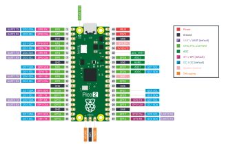

# Pico 2 + SHT30-D Thermometer Notes

| Field | Value |
|---|---|
| Document ID | TB-PICO-001 |
| Version | 1.2 |
| Date | 2026-10-03 |
| Element | `PICO-` — `benchtools.instruments.pico_sht30` and `firmware/pico_sht30` |
| Issue | #104, #127 |

A Raspberry Pi Pico 2 reads the local temperature from a DollaTek SHT30-D
module and reports it, with the firmware's title and version, over USB. This
note covers the hardware, the wiring, how to build and flash the firmware, how
to read it from the host, the facts taken from the reference documents, the
MISRA C position, and what remains to confirm on a bench.

## 1. Hardware

| Part | What it is | Reference |
|---|---|---|
| Raspberry Pi Pico 2 | RP2350A: dual Arm Cortex-M33 (or Hazard3 RISC-V) at 150 MHz, 520 KB SRAM, 4 MB flash, USB 1.1 device, two I2C controllers | Pico 2 datasheet, RP2350 datasheet (§2 of `References.md`) |
| DollaTek SHT30-D | A breakout board for the **Sensirion SHT30-DIS**: the sensor, a decoupling capacitor, I2C pull-up resistors, and an ADDR strap. Sold under several names (GY-SHT30-D). DollaTek publishes no datasheet of its own; the Sensirion datasheet is the authority for everything the firmware does. | Sensirion SHT3x-DIS datasheet |

SHT30-DIS in brief (Sensirion datasheet): 2.15–5.5 V supply; I2C up to 1 MHz;
address 0x44 (ADDR low) or 0x45 (ADDR high); temperature −40 to 125 °C
specified, ±0.2 °C typical from 0 to 65 °C; humidity 0–100 %RH, ±2 %RH typical
from 10 to 90 %RH.

## 2. Wiring



*Pinout: Raspberry Pi Ltd, `raspberrypi/documentation`, CC BY-SA 4.0.*

| SHT30-D pin | Pico 2 pin | Pico 2 function |
|---|---|---|
| VIN | 36 | 3V3(OUT) |
| GND | 38 | GND |
| SDA | 6 | GP4 — I2C0 SDA |
| SCL | 7 | GP5 — I2C0 SCL |
| ADDR | GND (or leave unconnected if the module pulls it low) | address 0x44 |
| ALERT | not connected | — |

The module carries its own pull-ups; the firmware enables the RP2350's internal
pull-ups as well, which is harmless in parallel and keeps a bare sensor usable.
Keep the wires short (under 30 cm at 100 kHz), and mount the sensor away from
the Pico: the RP2350 and its regulator warm the board by a degree or more, and
the sensor will report that faithfully.

Different wiring is a build option, not a source edit:

```
cmake -S firmware/pico_sht30 -B build/pico_sht30 \
      -DCMAKE_C_FLAGS="-DBOARD_I2C_SDA_PIN=16U -DBOARD_I2C_SCL_PIN=17U -DBOARD_SHT30_ADDRESS=0x45U"
```

## 3. Building and flashing

Prerequisites: CMake ≥ 3.13, the Arm GNU toolchain (`arm-none-eabi-gcc`), and
the Pico C SDK 2.1.1 or later with its TinyUSB submodule. SDK 2.x builds
`picotool` from source on first use if it is not installed.

```
git clone --branch 2.1.1 https://github.com/raspberrypi/pico-sdk
git -C pico-sdk submodule update --init lib/tinyusb
export PICO_SDK_PATH=$PWD/pico-sdk

cmake -S firmware/pico_sht30 -B build/pico_sht30
cmake --build build/pico_sht30 -j
```

This produces `build/pico_sht30/pico_sht30.uf2`. To download it to the Pico 2,
use one command (#127):

```
benchtools thermo -r /dev/ttyACM0 flash build/pico_sht30/pico_sht30.uf2 --expect-version 1.0.0
benchtools thermo -r COM5 flash build\pico_sht30\pico_sht30.uf2          # Windows
benchtools thermo -r '' flash build/pico_sht30/pico_sht30.uf2           # blank board; port found afterwards
```

It does what used to be three manual steps, and then checks the result:

1. **Into the bootloader.** If a drive named **RP2350** is already mounted, the
   Pico is in its bootloader already and that drive is used. This is how the
   first flash of a blank Pico 2 works: a board with no image starts in its
   bootloader. Otherwise the running thermometer is sent `bootsel`. If the port
   does not answer the protocol - another image is running, for instance - it
   is opened and closed at 1200 baud instead, which the Pico SDK's USB serial
   takes as a request to reboot into the bootloader. The command then waits
   for the drive (15 s, `--bootloader-timeout`).
2. **Copy.** The UF2 is checked first: every block must be well formed and for
   an RP2350, and the image must carry the thermometer's title (pass
   `--any-image` to flash something else). It is then copied onto the drive.
   The Pico reboots as the last block lands, and the drive goes away.
3. **Check.** The serial port comes back (20 s, `--port-timeout`; with `-r ''`
   it is found by the Raspberry Pi USB vendor ID), `ver` is read, and the title,
   the version (with `--expect-version`) and the build date are compared with
   the image. The build date is read from the image itself, so a match shows
   that the image just copied is the one running, not an older build of the
   same version.

The result is printed as JSON: the image, the drive, how the bootloader was
reached (`already-in-bootloader`, `bootsel` or `1200-baud`), `ver` before and
after, and each check with what was expected and what was found. The command
exits 0 only if every check passed; a mismatch, a timeout or a failed copy
exits 1. `--no-verify` skips the check, and `--drive E:` (or a mount point)
names the drive if it cannot be found. Drives are searched for on Windows
(drive letters), Linux (`/media`, `/run/media`, `/mnt`) and macOS (`/Volumes`);
on any other system, pass `--drive`. `-r sim://` runs the whole sequence
against a simulated board.

**When `flash` cannot help.** If the firmware has crashed, or the Pico does not
appear on USB at all, nothing on the host can reach it. Then use the button,
which always works:

1. Hold **BOOTSEL** and plug the Pico into USB.
2. A drive named **RP2350** appears.
3. Either copy `pico_sht30.uf2` onto it by hand, or run `flash` as above,
   which finds the drive already present. The Pico reboots into the
   thermometer and enumerates as a USB serial port (`/dev/ttyACM0` on Linux,
   `COMn` on Windows).

An SWD probe on the Pico's debug header is the other way in.

`flash` has so far been run only against the simulated board: it has not yet
been used on a real Pico 2 (PICO-OPEN-05).

Host unit tests for the firmware, no Pico needed:

```
cmake -S firmware/pico_sht30/test -B build/pico-tests
cmake --build build/pico-tests && ctest --test-dir build/pico-tests --output-on-failure
```

## 4. Using it

In a terminal (any serial program, 115200 8N1, although USB ignores the rate):

```
ver
ok title=Pico2-SHT30-Thermometer fw=1.0.0 built=2026-09-30T03:21:10Z proto=1.0 board=pico2 serial=E6614C311B7F2A21 sensor=SHT30-DIS addr=0x44 uptime_s=12
temp
ok t=22.848 rh=44.912 raw_t=0x6340 raw_rh=0x72F9
status
ok status=0x0010
```

From the host:

```
benchtools thermo -r /dev/ttyACM0 ver
benchtools thermo -r /dev/ttyACM0 temp --count 10 --interval 1
benchtools thermo -r sim:// temp          # no hardware
```

```python
from benchtools.instruments.pico_sht30 import PicoSht30

with PicoSht30.connect("/dev/ttyACM0") as thermometer:     # COM5 on Windows
    print(thermometer.title, thermometer.version)
    print("%.2f °C" % thermometer.temperature())
```

In a bench configuration the driver is named `pico-sht30` (alias
`thermometer`).

| Reply | Meaning | What to check |
|---|---|---|
| `err 4 the sensor did not acknowledge` | NACK at 0x44 | Wiring, power, ADDR strap (0x45?) |
| `err 5 the sensor checksum did not match` | Corrupted frame | Wire length, pull-ups, noise |
| `err 6 I2C bus timeout` | Transfer did not complete | SDA/SCL swapped, a line held low |

### 4.1 On a bench

Both shipped benches carry the thermometer as `temp`, named `TEMP` in the event
log (#126):

```yaml
temp:
  driver: pico-sht30
  resource: /dev/ttyACM2        # site-specific; sim:// in benches/simulated_bench.yaml
  timeout: 5.0
  event: TEMP
```

A specification uses it as `temp.read`, and can give it another name in the
event log, e.g. `temp: {driver: pico-sht30, event: ROOM}` - see the
[Bench Runner Guide §6.3](../Bench_Runner_Guide.md#63-event-log-names-which-instrument-said-what).
`TEMP` is also the driver's default, so it applies on any bench that names none.

## 5. Facts taken from the reference documents

| Fact | Value | Where used |
|---|---|---|
| Measure, single shot, high repeatability, no clock stretching | command 0x2400 | `SHT30_CMD_MEASURE_HIGH` |
| Max measurement duration, high repeatability | 15 ms | wait 16 ms |
| Read status register | 0xF32D | `SHT30_CMD_READ_STATUS` |
| Clear status register | 0x3041 | `SHT30_CMD_CLEAR_STATUS` (defined, not used) |
| Soft reset | 0x30A2, ready within 1.5 ms | wait 2 ms |
| CRC-8 | poly 0x31, init 0xFF, no reflection, no final XOR; CRC(0xBEEF) = 0x92 | `sht30_crc8` |
| Temperature | T = −45 + 175 · S_T / (2¹⁶ − 1) | `sht30_ticks_to_millicelsius` |
| Humidity | RH = 100 · S_RH / (2¹⁶ − 1) | `sht30_ticks_to_millipercent` |
| Status bits | 15 alert pending, 13 heater, 11 RH alert, 10 T alert, 4 reset detected, 1 command failed, 0 write CRC failed | `SHT30_STATUS_*`, `STATUS_BITS` |
| Pico 2 I2C0 default pins | GP4 SDA (pin 6), GP5 SCL (pin 7) | `board_config.h` |
| Pico 2 3V3(OUT) | pin 36, up to 300 mA for external circuits | wiring |

The command codes and CRC parameters were cross-checked against Sensirion's own
open-source driver (`github.com/Sensirion/embedded-i2c-sht3x`).

## 6. MISRA C:2012

The firmware is written to MISRA C:2012 (with Amendments 2 and 3, which cover
C11). Measures taken:

* No `<stdio.h>` formatting (Rule 21.6): replies are built with the bounded
  `text.c`, never `printf`/`snprintf`. Checked by a test.
* No dynamic memory (Rule 21.3), no recursion (Rule 17.2), no variadic functions
  (Rule 17.1).
* Fixed-width types throughout (Dir 4.6), `U` suffixes on unsigned constants
  (Rule 7.2), explicit casts on every narrowing (Rule 10.x), and 64-bit
  intermediate arithmetic where 32 bits would overflow.
* Every `if … else if` chain ends in `else`, every `switch` has `default`
  (Rules 15.7, 16.4); one exit per function (Rule 15.5).
* Pointer parameters are checked for NULL; outputs are written only on success.

Recorded deviations:

| Rule | Where | Justification |
|---|---|---|
| 21.6 (required) | `hal_pico.c` | `stdio_puts_raw` and `stdio_flush` are the Pico SDK's USB CDC output path; no formatting function is used. |
| Dir 4.6 (advisory) | `hal_pico.c` | Pico SDK prototypes use `uint` and `int`; values are cast at the boundary. |
| 20.10 (advisory) | `cmd_parser.c` | `#` and `##` in the X-macros that build the dispatch table from `protocol.h`, so the protocol is defined once (PICO-NFR-004). |
| 2.2 / Dir 4.1 | `main.c` | `for (;;)` without exit is the intended behaviour of an embedded main loop. |

All of the firmware's C code, host unit tests included, also passes the
project's C coding standard (TB-STD-002, TB-STY-001) as checked by CStyleCheck
in CI, with no baseline (PICO-NFR-006). The Pico step uses its own module alias
map (`.cstylecheck-pico-aliases.txt`) and a short, justified exclusion list
(`.cstylecheck-pico-exclusions.yml`): the `X` of the X-macro idiom, Unity's
`setUp`/`tearDown`, and literal reference vectors in the tests.

No MISRA checker was available in the build environment; a checker run is
PICO-OPEN-04.

## 7. Bench confirmation items

| ID | Item | How |
|---|---|---|
| PICO-OPEN-01 | USB enumeration and identity | Flash the UF2; `benchtools thermo -r <port> ver` must show the title `Pico2-SHT30-Thermometer` and version `1.0.0`. |
| PICO-OPEN-02 | Sensor on the bus, and a missing sensor reported | `temp` must answer `ok`; with SDA disconnected it must answer `err 4`, never a value. |
| PICO-OPEN-03 | Accuracy | Beside a calibrated reference thermometer, away from the Pico, after 10 minutes: agreement within ±0.2 °C typical (0–65 °C) plus the reference's own uncertainty. |
| PICO-OPEN-04 | Reference PDFs and MISRA tool run | The hosts serving the PDFs were blocked in the build environment; run `fetch_datasheets.sh` and commit the files. Run a MISRA C:2012 checker over `firmware/pico_sht30/src`. |
| PICO-OPEN-05 | Reflashing with `benchtools thermo flash` (#127) | Not yet confirmed on a real Pico 2: no Arm toolchain was available on the bench PC to build a UF2. With a built image, run `flash` three ways and check that each exits 0 with every check passing: from the running thermometer (method `bootsel`); from a board started with BOOTSEL held (method `already-in-bootloader`); and from a board running other USB-serial firmware built with the Pico SDK (method `1200-baud`), which also confirms that the SDK's 1200-baud reset is enabled in such a build. Confirm that the drive is found on the bench PC's operating system without `--drive`. |
